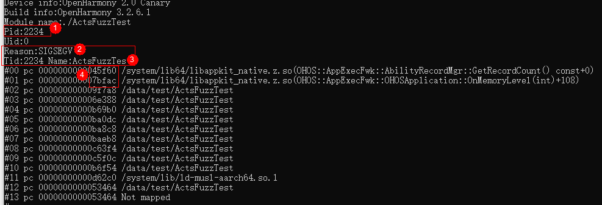
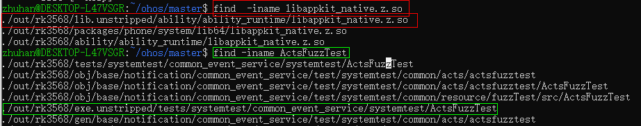
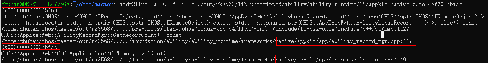

# Signal 11故障排查

## 1. Signal 11 简介

Signal 11 也即**SIGSEGV**： SIG 是信号名的通用前缀， SEGV 是segmentation violation，也就是存储器区段错误。

段错误是指程序访问了不允许访问的内存地址、访问了被系统保护的地址、试图写入只读地址等以其他非法的方式的访问内存地址。这些方式会产生signal 11 错误。

### 1.1 访问不存在的内存地址

```cpp
#include<iostream>
int main()
{
        int *ptr = NULL;
        *ptr = 0;
        
        return 0;
}
```

上面这段代码会产生`Segmentation fault`错误信息。

### 1.2  访问被系统保护的内存地址

```cpp
#include<iostream>

int main()
{
        int *ptr = (int *)0;
        *ptr = 100;  //可以访问。不可以修改

        return 0;
}
```

上面这段代码也会产生`Segmentation fault`错误信息。

### 1.3 栈溢出

```cpp
#include<iostream>

int main()
{
        main();
        return 0;
}
```

堆栈变大，会访问操作系统外的内存地址。

## 2. 报错日志

可以看到日志中最后出现signal 11 的

```xml
...
Uint16_t param is: 23421
call function : OHOSApplicationOnMemoryLevel
Int param is: -2041538394
Signal 11 
```

## 3.  崩溃日志

发现日志报段错误后找到设备中的崩溃日志。



崩溃日志中有几个关键信息。

1. Pid：奔溃的进程id
2. Reason ： 崩溃原因
3. Tid ：奔溃的线程id
4. 崩溃栈 ：对应的崩溃栈地址

通过崩溃日志可以确定崩溃的进程线程，便于从日志中排查问题。

## 4. 定位问题   

1. 找到崩溃日志中崩溃的.so和cpp文件，一般直接定位.so文件即可。

.so文件find之后直接寻找lib目录下的对应.so文件；cpp文件find后直接寻找exe目录下的

```shell
 find -iname libappkit_native.z.so
 find -iname ActsFuzzTest
```

2. 定位到具体的代码行号

```shell
# addr2line -a -C -f -i -e [lib目录] [崩溃日志的行号]..
addr2line -a -C -f -i -e ./out/rk3568/lib.unstripped/ability/ability_runtime/libappkit_native.z.so 45f60 7bfac
```



## 5. 检查代码

定位到`ability/ability_runtime/frameworks/native/appkit/app/ohos_application.cpp`下面这一行代码。而.h头文件中`abilityRecordMgr_`是这样定义的`std::shared_ptr<AbilityRecordMgr> abilityRecordMgr_ = nullptr;`。**因此此处可能是个空指针，需要加以判空后才能使用**。

```cpp
//修改前
HILOG_DEBUG("Number of ability to be notified : [%{public}d]", static_cast<int>(abilityRecordMgr_->GetRecordCount()));
...

//修改后
if(abilityRecordMgr_) {
    HILOG_DEBUG("Number of ability to be notified : [%{public}d]", static_cast<int>(abilityRecordMgr_->GetRecordCount()));
    ...
}
```

