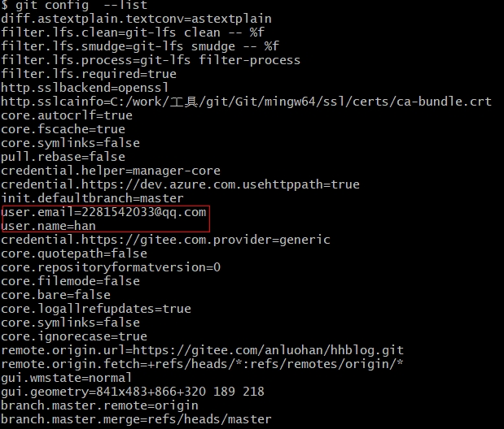

# Git

## 参考资料

[Pro Git 第二版](https://git-scm.com/book/zh/v2)

### 初始化

1. 安装完成后设置用户名和邮箱

```bash
git config --global user.name "your name"
git config --global user.email your-email
```

2. 查看完成的配置

```bash
git config --list
```



### 获取远端Git仓库

clone 仓库，clone后会在本地生成远端一摸一样完整的工程，并且会生成.git文件夹，本地和远端仓库通过这个.git文件夹交互。

```bash
git clone <url>
git clone https://gitee.com/anluohan/hhblog.git
```

### 一次完整的提交

```bash
#1.获取当前仓库最新的代码尽可能避免冲突
#查看远端，默认origin 
git remote -v 
#拉取这个远端仓库的branch分支代码到本地的local_baranch分支上
git fetch  <remote> <branch>:<local_baranch> 
#local_master分支是最新代码
git fetch origin master:local_master
#切换到这个分支
git switch local_master

#2.修改代码后提交到远端
git status #查看改动
git add -u #将改动添加到暂存区
git commit -sm "add code" #将改动提交到本地仓库
git push origin local_master #将本地仓库中local_master的改动提交到远端


```


### 查看提交文件

```bash
git log --name-only
```

### 分支

#### 本地分支

```bash
git branch -d zh #删除本地名为zh的分支

git branch -D $(git branch)
```

#### 远程分支

```bash
#创建分支，推送到远程分支
git branch test 
git push origin test

#删除远端分支
git push origin --delete test

git branch -r -d origin/zh #删除
git push origin :zh #sheng'xi

#创建干净分支
git fetch origin master:<new_branch_name>
git switch <new_banch_name> #该分支与远程master分支代码完全一样 
```


### repo sync

从远程仓库更新本地代码，如果远程仓库删除部分代码，使用该命令也会将本地的那部分代码删除.

repo sync -c --force-sync可以强制更新，但会将本地修改的代码删除.

| 参数  |                             作用                             |
| :---: | :----------------------------------------------------------: |
|  -c   |                    只从服务端获取当前分支                    |
|  -d   | 工作区项目进入分离头指针状态，并切换到 manifest 清单文件指定的提交。该参数对于编译构建时严格按照 manifest 清单文件检出提交，**丢弃工作区本地修改，非常有用** |
|  -f   |           即使某个项目同步失败，也继续同步其他项目           |
| -j<N> |                            并发数                            |
|  -n   | 只做网络端操作。即相当于只进行 `git fetch` 操作，不修改本地仓库的检出 |
|  -l   | 只做本地端操作。即相当于只进行 `git checkout` 操作，而不进行任何网络操作 |

**常用形式**：`repo sync -c -j10`

```
repo forall -c 'git lfs pull'
```

### untracked files

```bash
git clean -f #删除为跟踪文件

git clean -fd #删除为跟踪文件和目录

git clean -nfd #查看要删除的文件和目录，不会删除任何文件，仅查看
```

### 本地解决冲突

```
git fetch --all
git rebase origin/master  //将改动的分支节点以master为基点合入
// 解决冲突
git add xxx
git rebase --continue
git push xxx

```

